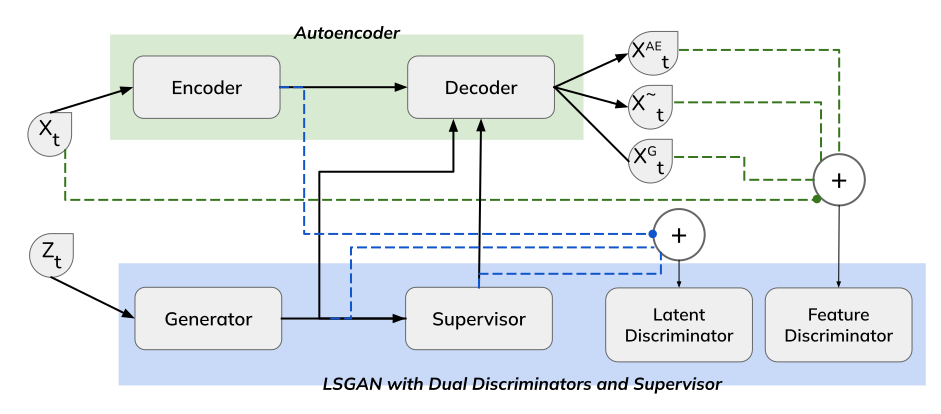

# SeriesGAN: Time Series Generation via Adversarial and Autoregressive Learning

## Abstract
Current Generative Adversarial Network (GAN)-based approaches for time series generation encounter difficulties such as slow convergence and information loss in embedding spaces. To overcome these challenges, we introduce an advanced framework that integrates the advantages of an autoencoder-generated embedding space with the adversarial training dynamics of GANs. This method employs two discriminators: one to guide the generator and another to refine the autoencoder's output. Additionally, our framework incorporates a novel autoencoder-based loss function and supervision from a teacher forcing supervisor network, which captures the stepwise conditional distributions of the data. The generator operates within the latent space, while the two discriminators work on latent and feature spaces separately, providing crucial feedback to both the generator and the autoencoder. By leveraging this dual-discriminator approach, we minimize information loss in the embedding space. Through joint training, our framework excels in generating high-fidelity time series data, consistently outperforming existing state-of-the-art benchmarks both qualitatively and quantitatively on a range of real and synthetic datasets.




## Installation
Clone the repository and install dependencies:
```bash
git clone https://github.com/samresume/SeriesGAN.git
cd SeriesGAN
pip install -r requirements.txt
```

## Usage
To get started, run the tutorial notebook:
```bash
jupyter notebook tutorial.ipynb
```

## Files
- `seriesgan.py`: Main implementation of the SeriesGAN model.
- `data_loading.py`: Functions for loading and preprocessing data.
- `utils.py`: Helper utilities for the model.

